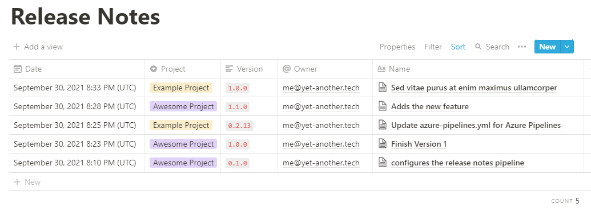

# Automated Release Notes (for Notion!)

## Overview
Automate release notes in your PR by setting a build validation step that requires a release notes pipeline to complete. The release not pipeline uses this task to pull out information about the release and posts that data to a Notion table.

 

## Getting Started
For setup instructions, visit: https://yet-another.tech/blog/00f210e1-fe9a-48ee-815e-b2eacd59d231

## Contributing
For source code, visit: https://github.com/nicktolhurst/notion-release-notes

Happy automating! 